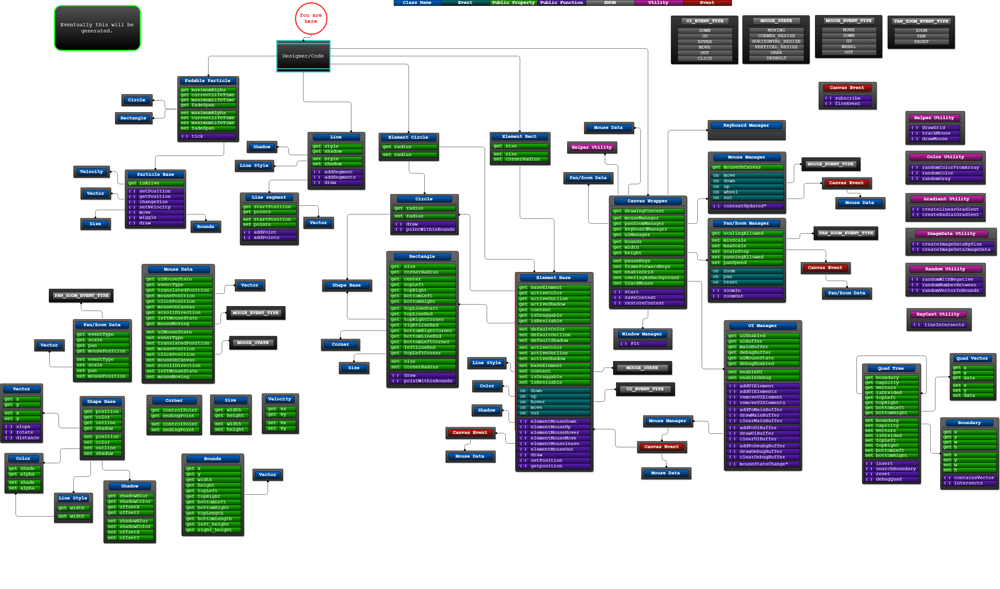

## About this Project
I wanted to play around with the canvas API.

### Setting up the project
I use `@angular/cli` because it allows anyone to build and execute the application in 4 steps or less.

* Open your terminal of choice and navigate to the root of the project folder.
* Run `npm install` to download all of the required packages. If you don't have `npm` you can download it from [nodejs.org](https://nodejs.org)
* After all packages are downloaded, you should be able to run `ng serve` in your terminal.  
This will launch a development server and watch for file changes. 
* Navigate to `http://localhost:4200/`. 
The app will automatically reload if you save any changes made to source while the server is running.

### Code Map

  

